# Modèle de données Maplenou — Entités & Classes

Ce document liste toutes les entités JPA (tables de la base PostgreSQL) du backend Maplenou,
leurs champs, leurs relations et les énumérations associées.

**Usage prévu** :
- À envoyer tel quel à **Claude Desktop** (ou tout autre outil) en lui demandant de dessiner le
  diagramme de classes — le bloc Mermaid ci-dessous est déjà un diagramme de classes exploitable
  directement, et les tableaux détaillés permettent de vérifier/compléter le résultat.
- À partager avec le **développeur frontend** pour qu'il comprenne la structure des données que
  l'API expose (noms de champs, types, relations, valeurs possibles des statuts).

Package racine de toutes les classes : `com.maplenou.backend.*`
Toutes les clés primaires (`id`) sont des `UUID` générés côté base (`GenerationType.UUID`).
Tous les montants d'argent sont en **FCFA**, stockés en `BigDecimal` (jamais de `float`/`double`).
Les entités ont presque toutes `createdAt`/`updatedAt` (`Instant`, UTC) gérés automatiquement.

---

## 1. Diagramme de classes (Mermaid)

```mermaid
classDiagram
    class User {
        UUID id
        String fullName
        String phoneNumber
        String email
        String passwordHash
        Role role
        String totpSecret
        boolean totpEnabled
        boolean active
        boolean phoneVerified
        Instant createdAt
        Instant updatedAt
    }

    class Address {
        UUID id
        String label
        String city
        String district
        String details
        Double latitude
        Double longitude
        boolean isDefault
    }

    class SellerProfile {
        UUID id
        String shopName
        SellerStatus status
        Instant createdAt
        Instant updatedAt
    }

    class Shop {
        UUID id
        String name
        String slug
        String description
        String logoUrl
        String coverUrl
        ShopStatus status
        String city
        String district
        BigDecimal latitude
        BigDecimal longitude
    }

    class Category {
        UUID id
        String name
        String slug
        boolean active
    }

    class Product {
        UUID id
        String name
        String slug
        String description
        BigDecimal basePrice
        ProductStatus status
        boolean deleted
    }

    class ProductVariant {
        UUID id
        String label
        BigDecimal priceOverride
        int stockQuantity
        String sku
    }

    class ProductImage {
        UUID id
        String url
        short position
    }

    class Cart {
        UUID id
        Instant createdAt
        Instant updatedAt
    }

    class CartItem {
        UUID id
        short quantity
    }

    class Favorite {
        UUID id
        Instant createdAt
    }

    class Order {
        UUID id
        AddressSnapshot deliveryAddress
        BigDecimal totalAmount
        OrderStatus status
        String paymentReference
        BigDecimal discountAmount
    }

    class AddressSnapshot {
        <<Embeddable>>
        String label
        String city
        String district
        String details
        BigDecimal latitude
        BigDecimal longitude
    }

    class SubOrder {
        UUID id
        BigDecimal subtotal
        BigDecimal commissionRate
        BigDecimal commissionAmount
        BigDecimal netAmount
        SubOrderStatus status
        String carrierCode
        String trackingNumber
        String carrierLabelUrl
    }

    class SubOrderItem {
        UUID id
        String snapshotProductName
        String snapshotVariantLabel
        String snapshotSku
        BigDecimal unitPrice
        short quantity
        BigDecimal lineTotal
    }

    class Delivery {
        UUID id
        DeliveryStatus status
        ProofType proofType
        String proofUrl
        String notes
        Instant assignedAt
        Instant deliveredAt
    }

    class DeliveryZone {
        UUID id
        String name
        BigDecimal deliveryFee
        int estimatedTimeMinutes
        boolean active
    }

    class Payout {
        UUID id
        Instant periodStart
        Instant periodEnd
        BigDecimal amount
        BigDecimal commissionTotal
        PayoutStatus status
        Instant paidAt
        String notes
    }

    class ProductReview {
        UUID id
        short rating
        String comment
    }

    class ShopReview {
        UUID id
        short rating
        String comment
    }

    class ReturnRequest {
        UUID id
        Instant deliveryDate
        Instant returnDeadline
        String reason
        ProductCondition productCondition
        ReturnDecision decision
        Instant decidedAt
        String adminNotes
        RefundStatus refundStatus
    }

    class PromoCode {
        UUID id
        String code
        PromoScopeType scopeType
        UUID scopeId
        BigDecimal discountPercent
        BigDecimal minOrderAmount
        Integer maxUses
        int currentUses
        Instant expiresAt
        boolean active
    }

    class PromoCodeUsage {
        UUID id
        BigDecimal discountAmount
        Instant usedAt
    }

    class Conversation {
        UUID id
        ConversationType type
        Instant lastMessageAt
    }

    class Message {
        UUID id
        String content
        Instant readAt
    }

    class ContentPage {
        UUID id
        String slug
        String title
        String body
        boolean published
    }

    class NewsletterSubscriber {
        UUID id
        String email
        boolean active
        Instant subscribedAt
        Instant unsubscribedAt
    }

    class DeviceToken {
        UUID id
        String token
        DevicePlatform platform
    }

    class AuditLog {
        UUID id
        UUID actorId
        AuditAction action
        String entityType
        UUID entityId
        String details
        String ipAddress
    }

    %% ── Relations ──────────────────────────────────────────────
    User "1" --> "0..1" SellerProfile : sellerProfile
    User "1" --> "*" Address : addresses
    User "1" --> "0..1" Cart : cart
    User "1" --> "*" Favorite : favorites
    User "1" --> "*" Order : commandes (buyer)
    User "1" --> "*" Delivery : livraisons assignées (agent)
    User "1" --> "*" ReturnRequest : retours demandés (buyer)
    User "1" --> "*" ProductReview : avis produits
    User "1" --> "*" ShopReview : avis boutiques
    User "1" --> "*" Message : messages envoyés
    User "1" --> "*" DeviceToken : appareils
    User "1" --> "*" PromoCodeUsage : codes utilisés
    User "1" --> "1" Shop : boutique (owner)
    Shop "1" --> "*" Product : produits
    Shop "1" --> "*" SubOrder : sous-commandes reçues
    Shop "1" --> "*" Payout : versements
    Shop "1" --> "*" ShopReview : avis reçus
    Shop "0..1" --> "*" Conversation : conversations (BUYER_SELLER)
    Category "0..1" --> "*" Category : sous-catégories (parent/enfant)
    Category "1" --> "*" Product : produits
    Product "1" --> "*" ProductImage : images
    Product "1" --> "*" ProductVariant : variantes
    Product "1" --> "*" Favorite : favoris
    Product "1" --> "*" ProductReview : avis
    ProductVariant "1" --> "*" CartItem : lignes de panier
    ProductVariant "0..1" --> "*" SubOrderItem : lignes commandées
    Cart "1" --> "*" CartItem : articles
    Order "1" --> "*" SubOrder : sous-commandes (1 par boutique)
    Order "0..1" --> "*" PromoCode : code promo appliqué
    Order "1" --> "*" PromoCodeUsage : utilisations
    Order *-- AddressSnapshot : deliveryAddress
    SubOrder "1" --> "*" SubOrderItem : articles
    SubOrder "0..1" --> "0..1" Payout : payout
    SubOrder "1" --> "0..1" Delivery : livraison
    SubOrder "1" --> "0..1" ReturnRequest : retour
    SubOrder "1" --> "*" ProductReview : preuve d'achat
    SubOrder "1" --> "*" ShopReview : preuve d'achat
    PromoCode "1" --> "*" PromoCodeUsage : historique
    Conversation "1" --> "*" Message : messages
```

> Note Mermaid : les classes `Role`, `SellerStatus`, `ShopStatus`, `ProductStatus`, `OrderStatus`,
> `SubOrderStatus`, `DeliveryStatus`, `ProofType`, `PayoutStatus`, `PromoScopeType`,
> `ConversationType`, `DevicePlatform`, `AuditAction`, `ProductCondition`, `ReturnDecision`,
> `RefundStatus` sont des **enums** (voir §3) référencés en tant que type d'attribut plutôt que
> dessinés comme des classes séparées, pour garder le diagramme lisible.

---

## 2. Détail des entités par module

### Module `user`

**`User`** — compte unique pour tous les rôles (acheteur par défaut, vendeur en cumul via
`SellerProfile`, ADMIN/DELIVERY_AGENT via `role`).

| Champ | Type | Contraintes | Description |
|---|---|---|---|
| id | UUID | PK | |
| fullName | String | NOT NULL | |
| phoneNumber | String | NOT NULL, UNIQUE | identifiant de connexion |
| email | String | nullable | |
| passwordHash | String | NOT NULL | jamais exposé (JsonIgnore) |
| role | Role (enum) | nullable | null = acheteur simple |
| sellerProfile | → SellerProfile | 1-1, LAZY | présence + APPROVED = droits vendeur |
| totpSecret | String | nullable | secret 2FA (TOTP) |
| totpEnabled | boolean | default false | |
| active | boolean | default true | false = compte banni/anonymisé |
| phoneVerified | boolean | default false | |
| createdAt / updatedAt | Instant | auto | |

**`Address`** — carnet d'adresses de livraison d'un utilisateur.

| Champ | Type | Description |
|---|---|---|
| id | UUID | PK |
| user | → User | ManyToOne obligatoire |
| label | String | ex: "Maison", "Bureau" |
| city, district, details | String | localisation |
| latitude, longitude | Double | GPS |
| isDefault | boolean | adresse par défaut |

### Module `seller`

**`SellerProfile`** — profil vendeur optionnel, 1-1 avec `User` (pas un rôle : un compte cumule
client + vendeur).

| Champ | Type | Description |
|---|---|---|
| id | UUID | PK |
| user | → User | OneToOne, unique |
| shopName | String | |
| status | SellerStatus (enum) | PENDING / APPROVED / SUSPENDED / REJECTED |
| createdAt / updatedAt | Instant | |

### Module `catalog`

**`Shop`** — boutique d'un vendeur (1 compte = 1 boutique, contrainte unique sur `owner_id`).

| Champ | Type | Description |
|---|---|---|
| id | UUID | PK |
| owner | → User | ManyToOne unique |
| name, slug, description | String | |
| logoUrl, coverUrl | String | URLs Cloudinary |
| status | ShopStatus (enum) | PENDING / APPROVED / SUSPENDED / REJECTED |
| city, district | String | |
| latitude, longitude | BigDecimal | point de récupération pour le livreur |
| createdAt / updatedAt | Instant | |

**`Category`** — arborescence de catégories (auto-référence `parent`, chargement LAZY).

| Champ | Type | Description |
|---|---|---|
| id | UUID | PK |
| name, slug | String | |
| parent | → Category | ManyToOne, nullable (racine si null) |
| active | boolean | |

**`Product`** — produit d'une boutique, rattaché à une catégorie.

| Champ | Type | Description |
|---|---|---|
| id | UUID | PK |
| shop | → Shop | ManyToOne obligatoire |
| category | → Category | ManyToOne obligatoire |
| name, slug, description | String | |
| basePrice | BigDecimal | FCFA, min. 500 (vérifié en service) |
| status | ProductStatus (enum) | DRAFT / ACTIVE / OUT_OF_STOCK / ARCHIVED |
| deleted | boolean | soft delete (jamais de suppression physique) |
| images | → ProductImage[] | OneToMany, cascade ALL |
| variants | → ProductVariant[] | OneToMany, cascade ALL |

**`ProductVariant`** — déclinaison d'un produit (porte le prix effectif et le stock).

| Champ | Type | Description |
|---|---|---|
| id | UUID | PK |
| product | → Product | ManyToOne obligatoire |
| label | String | ex: "Taille M / Rouge" |
| priceOverride | BigDecimal | nullable — si null, utilise `product.basePrice` |
| stockQuantity | int | |
| sku | String | unique |

**`ProductImage`** — image d'un produit, ordonnée.

| Champ | Type | Description |
|---|---|---|
| id | UUID | PK |
| product | → Product | ManyToOne obligatoire |
| url | String | Cloudinary |
| position | short | 0 = image principale |

### Module `cart`

**`Cart`** — panier actif, unique par utilisateur.

| Champ | Type | Description |
|---|---|---|
| id | UUID | PK |
| user | → User | OneToOne unique |
| items | → CartItem[] | OneToMany, cascade ALL |

**`CartItem`** — ligne de panier (référence une variante, pas un produit).

| Champ | Type | Description |
|---|---|---|
| id | UUID | PK |
| cart | → Cart | ManyToOne obligatoire |
| variant | → ProductVariant | ManyToOne obligatoire |
| quantity | short | default 1 |

**`Favorite`** — produit mis en favori par un utilisateur (unique par couple user+product).

| Champ | Type | Description |
|---|---|---|
| id | UUID | PK |
| user | → User | ManyToOne |
| product | → Product | ManyToOne |

### Module `order`

**`Order`** — commande globale d'un acheteur (peut couvrir plusieurs boutiques → `subOrders`).

| Champ | Type | Description |
|---|---|---|
| id | UUID | PK |
| buyer | → User | ManyToOne obligatoire |
| deliveryAddress | AddressSnapshot (Embeddable) | copie figée de l'adresse au moment de la commande (RGPD : indépendante de `Address`) |
| totalAmount | BigDecimal | |
| status | OrderStatus (enum) | CREATED / PAID / CLOSED / CANCELLED / PAYMENT_FAILED / PARTIALLY_REFUNDED / REFUNDED |
| paymentReference | String | |
| promoCode | → PromoCode | ManyToOne, nullable |
| discountAmount | BigDecimal | default 0 |
| subOrders | → SubOrder[] | OneToMany, cascade ALL |

**`SubOrder`** — part de la commande destinée à une boutique précise (1 par boutique impliquée).

| Champ | Type | Description |
|---|---|---|
| id | UUID | PK |
| order | → Order | ManyToOne obligatoire |
| shop | → Shop | ManyToOne obligatoire |
| subtotal, commissionRate, commissionAmount, netAmount | BigDecimal | commission = 25% ou 22,5% |
| status | SubOrderStatus (enum) | PENDING / PREPARING / READY_FOR_PICKUP / IN_DELIVERY / DELIVERED / CANCELLED / RETURN_REQUESTED / RETURNED |
| items | → SubOrderItem[] | OneToMany, cascade ALL |
| payout | → Payout | ManyToOne, nullable (rattaché une fois payé) |
| carrierCode, trackingNumber, carrierLabelUrl | String | transporteur tiers (Colissimo, scaffold) |

**`SubOrderItem`** — ligne de commande, snapshot figé au moment de l'achat.

| Champ | Type | Description |
|---|---|---|
| id | UUID | PK |
| subOrder | → SubOrder | ManyToOne obligatoire |
| productVariant | → ProductVariant | ManyToOne, nullable (peut être supprimée après coup) |
| snapshotProductName, snapshotVariantLabel, snapshotSku | String | figés, ne varient plus |
| unitPrice, lineTotal | BigDecimal | |
| quantity | short | |

**`AddressSnapshot`** *(Embeddable, pas une table à part — colonnes `delivery_*` dans `orders`)*

| Champ | Type |
|---|---|
| label, city, district, details | String |
| latitude, longitude | BigDecimal |

### Module `delivery`

**`Delivery`** — livraison du dernier kilomètre d'une sous-commande (1-1).

| Champ | Type | Description |
|---|---|---|
| id | UUID | PK |
| subOrder | → SubOrder | OneToOne unique |
| agent | → User | ManyToOne, nullable (livreur assigné) |
| status | DeliveryStatus (enum) | PENDING / ASSIGNED / IN_TRANSIT / DELIVERED / FAILED |
| proofType | ProofType (enum) | PHOTO / SIGNATURE |
| proofUrl | String | preuve Cloudinary |
| notes | String | |
| assignedAt, deliveredAt | Instant | |

**`DeliveryZone`** — zone de livraison avec frais et délai.

| Champ | Type | Description |
|---|---|---|
| id | UUID | PK |
| name | String | unique, ex: "Grand Lomé" |
| deliveryFee | BigDecimal | |
| estimatedTimeMinutes | int | default 60 |
| active | boolean | |

### Module `payout`

**`Payout`** — versement périodique à une boutique (cron hebdo, lundi 2h UTC).

| Champ | Type | Description |
|---|---|---|
| id | UUID | PK |
| shop | → Shop | ManyToOne obligatoire |
| periodStart, periodEnd | Instant | |
| amount | BigDecimal | net reversé (somme des `netAmount` des SubOrders inclus) |
| commissionTotal | BigDecimal | commission Maplenou totale sur la période |
| status | PayoutStatus (enum) | PENDING / PROCESSING / PAID / FAILED |
| paidAt | Instant | |
| notes | String | référence virement, motif d'échec, etc. |

### Module `review`

**`ProductReview`** — avis sur un produit (unique par couple product+user, preuve d'achat via `subOrder`).

| Champ | Type | Description |
|---|---|---|
| id | UUID | PK |
| product | → Product | ManyToOne |
| author | → User | ManyToOne |
| subOrder | → SubOrder | ManyToOne obligatoire, doit être DELIVERED |
| rating | short | 1 à 5 |
| comment | String | |

**`ShopReview`** — même principe, avis sur une boutique (unique par couple shop+user).

| Champ | Type | Description |
|---|---|---|
| id | UUID | PK |
| shop | → Shop | ManyToOne |
| author | → User | ManyToOne |
| subOrder | → SubOrder | ManyToOne obligatoire |
| rating | short | 1 à 5 |
| comment | String | |

### Module `returns`

**`ReturnRequest`** — demande de retour, un seul retour possible par sous-commande.

| Champ | Type | Description |
|---|---|---|
| id | UUID | PK |
| subOrder | → SubOrder | OneToOne unique |
| buyer | → User | ManyToOne obligatoire |
| deliveryDate | Instant | snapshot de `Delivery.deliveredAt` |
| returnDeadline | Instant | deliveryDate + 30 jours |
| reason | String | |
| productCondition | ProductCondition (enum) | NEW / GOOD / DAMAGED |
| decision | ReturnDecision (enum) | APPROVED / REJECTED, null tant que non décidé |
| decidedAt | Instant | |
| decidedBy | → User | ManyToOne, nullable (vendeur ou admin) |
| adminNotes | String | |
| refundStatus | RefundStatus (enum) | PENDING / PROCESSING / REFUNDED / DENIED |

### Module `promo`

**`PromoCode`** — code de réduction, portée plateforme ou boutique.

| Champ | Type | Description |
|---|---|---|
| id | UUID | PK |
| code | String | |
| scopeType | PromoScopeType (enum) | PLATFORM / SHOP |
| scopeId | UUID | nullable, id boutique si scope = SHOP |
| discountPercent | BigDecimal | |
| minOrderAmount | BigDecimal | nullable |
| maxUses | Integer | nullable = illimité |
| currentUses | int | |
| expiresAt | Instant | nullable |
| active | boolean | |

Méthodes métier : `isExpired()`, `isExhausted()`, `isApplicableTo(montant)`, `computeDiscount(montant)`.

**`PromoCodeUsage`** — historique d'utilisation d'un code promo.

| Champ | Type | Description |
|---|---|---|
| id | UUID | PK |
| promoCode | → PromoCode | ManyToOne |
| order | → Order | ManyToOne |
| user | → User | ManyToOne |
| discountAmount | BigDecimal | |
| usedAt | Instant | |

### Module `messaging`

**`Conversation`** — fil de discussion acheteur↔vendeur ou utilisateur↔support.

| Champ | Type | Description |
|---|---|---|
| id | UUID | PK |
| type | ConversationType (enum) | BUYER_SELLER / SUPPORT |
| shop | → Shop | ManyToOne, nullable (null si SUPPORT) |
| buyer | → User | ManyToOne obligatoire |
| seller | → User | ManyToOne, nullable (dénormalisé pour requêtes) |
| lastMessageAt | Instant | |

**`Message`** — message individuel d'une conversation. Filtré anti-coordonnées personnelles
(`PersonalDataFilter`) sur les conversations BUYER_SELLER.

| Champ | Type | Description |
|---|---|---|
| id | UUID | PK |
| conversation | → Conversation | ManyToOne obligatoire |
| sender | → User | ManyToOne obligatoire |
| content | String | |
| readAt | Instant | nullable |

### Module `content`

**`ContentPage`** — page CMS (CGU/CGV/FAQ).

| Champ | Type | Description |
|---|---|---|
| id | UUID | PK |
| slug | String | unique |
| title, body | String | |
| published | boolean | |

### Module `newsletter`

**`NewsletterSubscriber`** — capture simple d'email (pas d'envoi automatique, pas de sync externe).

| Champ | Type | Description |
|---|---|---|
| id | UUID | PK |
| email | String | unique |
| active | boolean | |
| subscribedAt, unsubscribedAt | Instant | |

### Module `notification`

**`DeviceToken`** — token FCM d'un appareil pour les notifications push.

| Champ | Type | Description |
|---|---|---|
| id | UUID | PK |
| user | → User | ManyToOne obligatoire |
| token | String | fourni par le SDK Firebase client |
| platform | DevicePlatform (enum) | ANDROID / IOS / WEB |

### Module `audit`

**`AuditLog`** — journal d'audit immuable (aucune FK stricte vers `User`, juste un `actorId` brut).

| Champ | Type | Description |
|---|---|---|
| id | UUID | PK |
| actorId | UUID | nullable |
| action | AuditAction (enum) | voir §3 |
| entityType | String | ex: "Shop", "PromoCode" |
| entityId | UUID | nullable |
| details | String | |
| ipAddress | String | |

---

## 3. Énumérations

| Enum | Valeurs |
|---|---|
| `Role` | ADMIN, DELIVERY_AGENT *(null = acheteur simple)* |
| `SellerStatus` | PENDING, APPROVED, SUSPENDED, REJECTED |
| `ShopStatus` | PENDING, APPROVED, SUSPENDED, REJECTED |
| `ProductStatus` | DRAFT, ACTIVE, OUT_OF_STOCK, ARCHIVED |
| `OrderStatus` | CREATED, PAID, CLOSED, CANCELLED, PAYMENT_FAILED, PARTIALLY_REFUNDED, REFUNDED |
| `SubOrderStatus` | PENDING, PREPARING, READY_FOR_PICKUP, IN_DELIVERY, DELIVERED, CANCELLED, RETURN_REQUESTED, RETURNED |
| `DeliveryStatus` | PENDING, ASSIGNED, IN_TRANSIT, DELIVERED, FAILED |
| `ProofType` | PHOTO, SIGNATURE |
| `PayoutStatus` | PENDING, PROCESSING, PAID, FAILED |
| `PromoScopeType` | PLATFORM, SHOP |
| `ProductCondition` | NEW, GOOD, DAMAGED |
| `ReturnDecision` | APPROVED, REJECTED |
| `RefundStatus` | PENDING, PROCESSING, REFUNDED, DENIED |
| `ConversationType` | BUYER_SELLER, SUPPORT |
| `DevicePlatform` | ANDROID, IOS, WEB |
| `AuditAction` | USER_ANONYMIZED, USER_ROLE_CHANGED, USER_BANNED, USER_UNBANNED, USER_LOGIN, USER_LOGIN_FAILED, USER_LOGOUT, SHOP_STATUS_CHANGED, RETURN_DECIDED, PROMO_CODE_CREATED, PROMO_CODE_STATUS_CHANGED, SUBORDER_STATUS_CHANGED_ADMIN, TWO_FA_ENABLED, TWO_FA_DISABLED, SELLER_APPROVED, SELLER_REJECTED, PAYOUT_GENERATED, PAYOUT_PROCESSING, PAYOUT_MARKED_PAID, PAYOUT_MARKED_FAILED, CONTENT_PAGE_CREATED, CONTENT_PAGE_UPDATED, CONTENT_PAGE_DELETED |

---

## 4. Repères pour le développeur frontend

- Toutes les commandes multi-boutiques : une `Order` (paiement unique côté client) se découpe en
  une `SubOrder` par boutique, chacune suivant son propre statut de préparation/livraison
  indépendamment des autres.
- Le panier (`Cart`/`CartItem`) référence des `ProductVariant`, jamais directement des `Product`
  (le prix et le stock vivent sur la variante).
- Les montants affichés doivent toujours être formatés en FCFA (entiers, pas de centimes en usage
  courant même si le type est `BigDecimal` en base).
- Les avis (`ProductReview`/`ShopReview`) ne sont postables qu'après livraison confirmée
  (`SubOrder.status = DELIVERED`), un seul avis par utilisateur et par produit/boutique.
- Un compte peut être acheteur ET vendeur en même temps (`SellerProfile` présent + `status =
  APPROVED`) — l'app doit gérer l'affichage conditionnel des fonctionnalités vendeur sur le même
  compte plutôt qu'un compte séparé.
