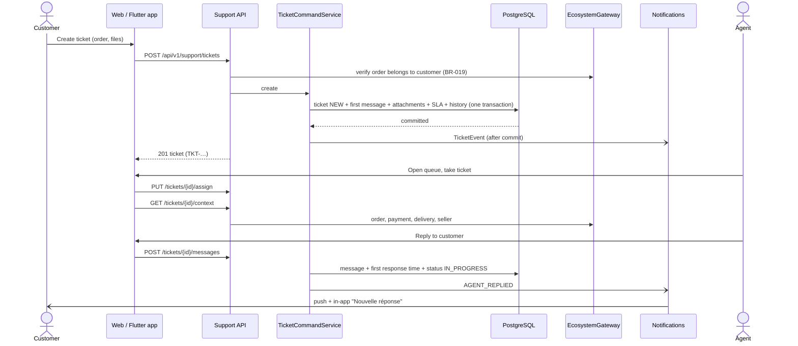

# Ticket Interaction

Main create → handle → reply flow through the implemented API.

Source: `ticket-sequence.mmd`

```mermaid
sequenceDiagram
    actor Customer
    participant Web as Web / Flutter app
    participant API as Support API
    participant Svc as TicketCommandService
    participant DB as PostgreSQL
    participant Eco as EcosystemGateway
    participant Notif as Notifications
    actor Agent

    Customer->>Web: Create ticket (order, files)
    Web->>API: POST /api/v1/support/tickets
    API->>Eco: verify order belongs to customer (BR-019)
    API->>Svc: create
    Svc->>DB: ticket NEW + first message + attachments + SLA + history (one transaction)
    DB-->>Svc: committed
    Svc-)Notif: TicketEvent (after commit)
    API-->>Web: 201 ticket (TKT-…)
    Agent->>Web: Open queue, take ticket
    Web->>API: PUT /tickets/{id}/assign
    Web->>API: GET /tickets/{id}/context
    API->>Eco: order, payment, delivery, seller
    Agent->>Web: Reply to customer
    Web->>API: POST /tickets/{id}/messages
    Svc->>DB: message + first response time + status IN_PROGRESS
    Svc-)Notif: AGENT_REPLIED
    Notif-)Customer: push + in-app "Nouvelle réponse"
```
